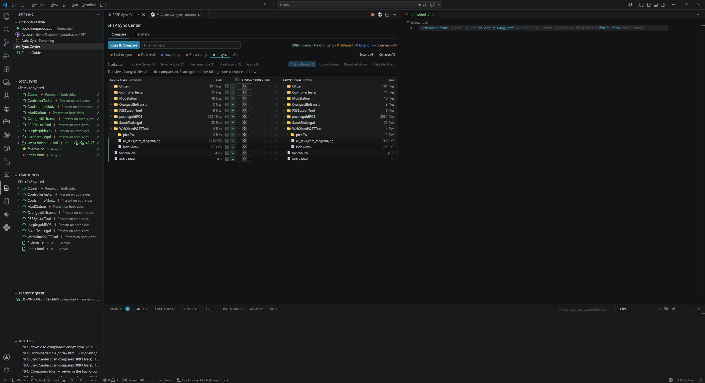
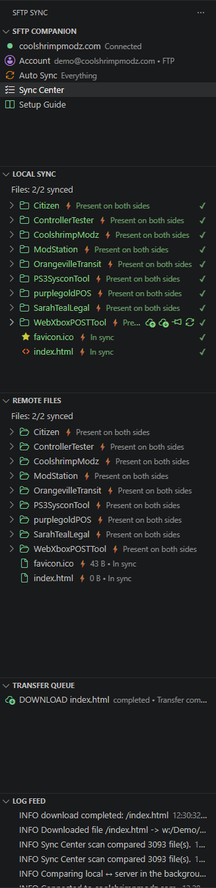
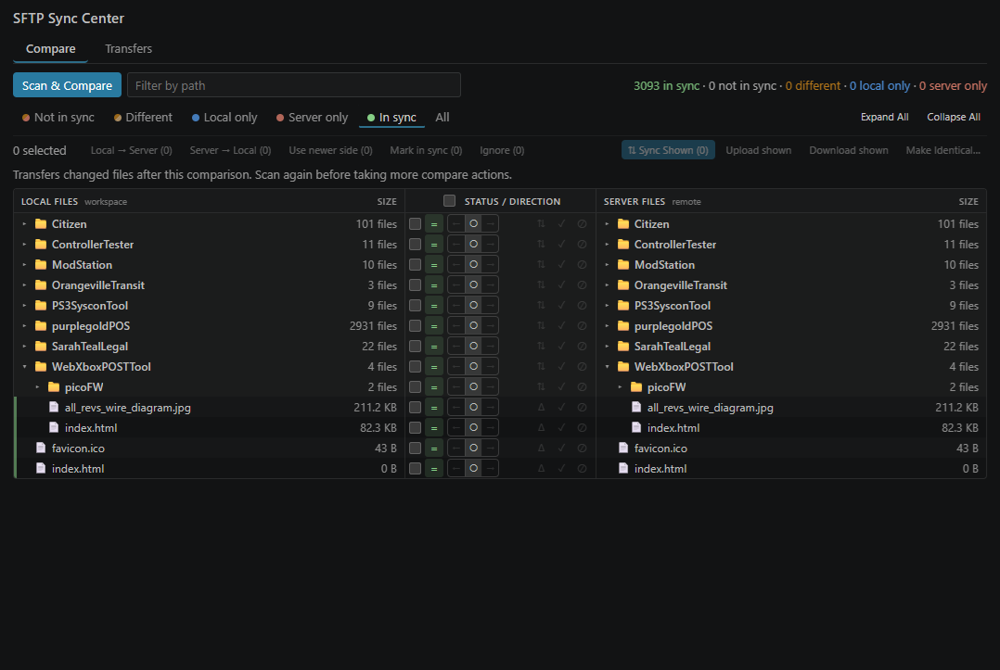

# SFTP Companion

[](https://marketplace.visualstudio.com/items?itemName=coolshrimp.sftp-companion)
[](https://marketplace.visualstudio.com/items?itemName=coolshrimp.sftp-companion)
[](https://marketplace.visualstudio.com/items?itemName=coolshrimp.sftp-companion&ssr=false#review-details)
[](LICENSE)

Standalone SFTP / FTP / FTPS sync for VS Code — a visual account manager, sync-status file trees, a full compare view, and a transfer queue with real progress. Built for the classic workflow of administering a live site from your editor.

**[➜ Install from the VS Code Marketplace](https://marketplace.visualstudio.com/items?itemName=coolshrimp.sftp-companion)**







## Features

- **Works with SFTP, FTPS, and plain FTP** — one protocol dropdown, correct ports filled in automatically, clear errors when protocol and port don't match.
- **Account Manager panel** — set up host, credentials, remote path, sync folder, ignore patterns, and auto-sync without touching JSON (but the JSON stays there if you prefer it — see below).
- **Passwords stay out of files** — credentials are stored only in VS Code SecretStorage (your OS credential vault). They are never written to disk, and the config files are hard-blocked from ever uploading to the server.
- **Local & Remote trees with sync colors** — green in sync, orange newer/changed, red missing, and yellow ignored. Hover buttons and right-click menus provide upload / download / diff / smart sync on every item.
- **Sync Center** — scan both sides recursively in paired, row-aligned **Local** and **Server** file trees, color-coded by status (in sync, local newer, server newer, local only, server only). Filter by *Not in sync / Different / Local only / Server only / In sync*, then **stage a direction** on each file, folder, or multi-selection (← download · ○ skip · → upload, with the recommended side hinted) and press **Sync Planned** once to run the whole batch — nothing transfers until you do. Right-clicking a selection applies upload, download, mark-in-sync, or ignore to every selected file. Timestamp-only mark-in-sync, persistent ignore, and local↔server diff are all here too.
- **Transfer queue** — parallel connections, per-file progress, pause / resume / stop / retry, and a compact paged history that keeps active and failed work ahead of thousands of completed files.
- **Auto-sync (opt-in)** — manual by default; sync only a pinned list of folders, or everything under the sync root. Optional delete mirroring can also remove the matching server file or recursively remove a matching server folder; the Account Manager requires explicit confirmation when either behavior is enabled.
- **Self-healing transfers** — auto-reconnects dropped connections, creates missing remote folders, and repairs paths blocked by junk zero-byte files.
- **Multiple server profiles per project** — a `profiles` block in `sftp.json` (dev/staging/production) with a one-click switcher; passwords are shared per server via the vault.
- **Remote file management** — rename/move, new file/folder, chmod, and confirmed multi-select deletion for files and folders, right from the Remote Files tree.
- **Make Identical** — pick a source of truth and mirror the other side's file set (including orphan-file deletion), with a dry-run confirmation of the counts. Empty directories are not mirrored.
- **Conflict guard** — auto-upload warns instead of clobbering when the server copy changed after your local edit.

## Install

- **Marketplace:** [SFTP Companion](https://marketplace.visualstudio.com/items?itemName=coolshrimp.sftp-companion) — hit **Install** and it opens VS Code.
- **Inside VS Code:** Extensions panel (`Ctrl+Shift+X`) → search **SFTP Companion**.
- **Command line:** `code --install-extension coolshrimp.sftp-companion`

## Quick start

1. Install the extension and open your project folder.
2. Click the **SFTP Sync** icon in the activity bar, then **Account**.
3. Choose your protocol, enter host / username / password and the remote path (e.g. `/public_html`), and hit **Save**.
4. The Remote Files view connects automatically. Open the **Setup Guide** (book icon) for a full walkthrough.

| Protocol | Port | When |
|----------|------|------|
| SFTP | 22 | Host provides SSH access (fastest, encrypted) |
| FTPS | 21 | Classic FTP account, encrypted with TLS |
| FTP  | 21 | Plain FTP — works everywhere |

## Where settings live

Everything except the password is plain, hand-editable JSON — edit the files or use the GUI, both stay in sync:

- `.vscode/sftp.json` — host, protocol, port, username, remote path, ignore patterns (standard sftp.json schema, portable).
- `.vscode/sftp-companion.json` — sync folder, auto-sync mode, sync list, hidden-file preference.
- Workspace setting `sftpCompanion.autoDeleteRemote` — opt-in mirroring of local file/folder deletions to the server. A folder delete is recursive and can remove ignored or remote-only descendants; enabling it in the Account Manager shows a modal warning, while direct JSON/Settings edits rely on this setting description.
- **Password** — VS Code SecretStorage only. To change it by hand, paste `"password": "..."` into `sftp.json` and save: it is absorbed into secure storage and scrubbed from the file automatically.

## Safety rails

- SFTP host keys are pinned on first connect (like SSH `known_hosts`); if the server's key ever changes you see both fingerprints and must explicitly trust the new one.
- Auto-upload modes require modal confirmation before they turn on.
- New accounts begin with security-focused ignores for `.git`, `.gitignore`, `.vscode`, environment files, common credential files, and private-key formats. The list remains editable.
- The `.vscode` folder is hard-blocked from deployment even if its ignore entry is removed (the extension's private remote-edit cache is the only internal exception).
- Bulk transfers of 25+ files ask before queueing.
- Destructive **Make Identical** is disabled when a comparison scan is capped or cannot read part of either tree.
- Multi-select server deletion always prompts; single-item deletion prompts by default (configurable).
- Delete mirroring is off by default and asks for a separate destructive-action confirmation before it can be enabled.

## Development

```powershell
npm install
npm run check-types  # type-check with tsc
npm run bundle       # bundle to dist/extension.js with esbuild
npm run deploy       # package the VSIX and install it into VS Code
npm run watch:deploy # rebuild + reinstall on every change
```

## License

[MIT](LICENSE)
