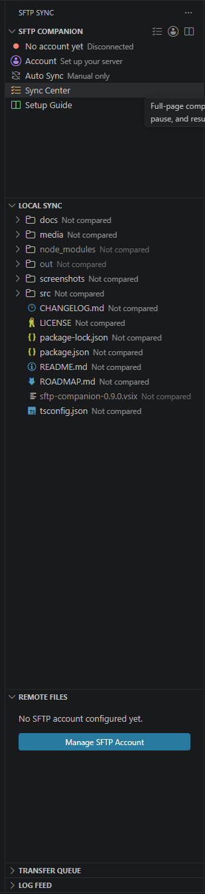

# SFTP Companion

Standalone SFTP / FTP / FTPS sync for VS Code — a visual account manager, sync-status file trees, a full compare view, and a transfer queue with real progress. Built for the classic workflow of administering a live site from your editor.



## Features

- **Works with SFTP, FTPS, and plain FTP** — one protocol dropdown, correct ports filled in automatically, clear errors when protocol and port don't match.
- **Account Manager panel** — set up host, credentials, remote path, sync folder, ignore patterns, and auto-sync without touching JSON (but the JSON stays there if you prefer it — see below).
- **Passwords stay out of files** — credentials are stored only in VS Code SecretStorage (your OS credential vault). They are never written to disk, and the config files are hard-blocked from ever uploading to the server.
- **Local & Remote trees with sync colors** — green in sync, blue newer on one side, red missing, orange folders containing changes. Hover buttons and right-click menus for upload / download / diff / smart sync on every item.
- **Sync Center** — scan both sides recursively and see every difference in one collapsible tree. Filter, multi-select with checkboxes, right-click context menus, and bulk *Upload / Download / Sync Selected* where each file goes in whichever direction its newer side dictates.
- **Transfer queue** — parallel connections, per-file progress bars, pause / resume / stop / retry, and a live log feed.
- **Auto-sync (opt-in)** — manual by default; sync only a pinned list of folders, or everything under the sync root. Enabling auto-upload always asks for explicit confirmation first.
- **Self-healing transfers** — auto-reconnects dropped connections, creates missing remote folders, and repairs paths blocked by junk zero-byte files.
- **Multiple server profiles per project** — a `profiles` block in `sftp.json` (dev/staging/production) with a one-click switcher; passwords are shared per server via the vault.
- **Remote file management** — rename/move, new file/folder, delete, and chmod with the current permissions shown, right from the Remote Files tree.
- **Make Identical** — pick a source of truth and mirror the other side exactly (orphan deletion included), with a dry-run confirmation of the counts.
- **Conflict guard** — auto-upload warns instead of clobbering when the server copy changed after your local edit.

## Quick start

1. Install the extension and open your project folder.
2. Click the **SFTP Sync** icon in the activity bar, then **Account**.
3. Choose your protocol, enter host / username / password and the remote path (e.g. `/public_html`), and hit **Save**.
4. The Remote Files view connects automatically. Open the **Setup Guide** (book icon) for a full walkthrough.

| Protocol | Port | When |
|----------|------|------|
| SFTP | 22 | Host provides SSH access (fastest, encrypted) |
| FTPS | 21 | Classic FTP account, encrypted with TLS |
| FTP  | 21 | Plain FTP — works everywhere |

## Where settings live

Everything except the password is plain, hand-editable JSON — edit the files or use the GUI, both stay in sync:

- `.vscode/sftp.json` — host, protocol, port, username, remote path, ignore patterns (standard sftp.json schema, portable).
- `.vscode/sftp-companion.json` — sync folder, auto-sync mode, sync list, hidden-file preference.
- **Password** — VS Code SecretStorage only. To change it by hand, paste `"password": "..."` into `sftp.json` and save: it is absorbed into secure storage and scrubbed from the file automatically.

## Safety rails

- Auto-upload modes require modal confirmation before they turn on.
- Bulk transfers of 25+ files ask before queueing.
- `sftp.json` / `sftp-companion.json` can never be uploaded, regardless of settings.
- Deleting on the server always prompts (configurable), and local files are never deleted by remote operations unless you opt in.

## Development

```powershell
npm install
npm run compile      # type-check + build
npm run deploy       # package the VSIX and install it into VS Code
npm run watch:deploy # rebuild + reinstall on every change
```

## License

[MIT](LICENSE)
